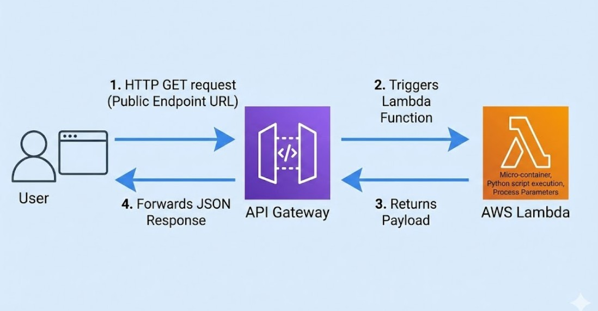
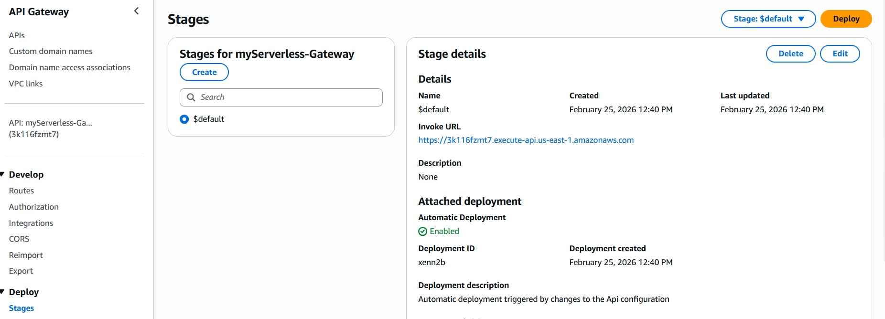
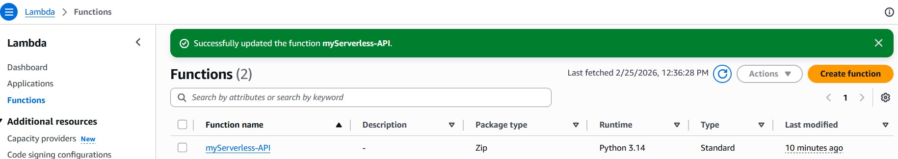

# aws-serverless-api-lambda
moved away from traditional server-based infrastructure (like EC2) and built a fully **Serverless** application. The goal was to deploy a Python script that executes on-demand via a public URL


##  Tech Stack Used
* **Compute:** AWS Lambda (Python 3.12)
* **Routing & Endpoint:** Amazon API Gateway (HTTP API)
* **Data Format:** JSON


##  Architecture Flow




1. **User** makes an HTTP GET request to the public endpoint URL generated by API Gateway.



2. **API Gateway** acts as the "front door", receives the request, and triggers the Lambda function.


3. **AWS Lambda** spins up a micro-container in milliseconds, executes the Python script, processes any URL parameters (Query Strings), and returns the payload.


   
5. **API Gateway** forwards the JSON response back to the user's browser.


## The Python Code (Lambda Handler)
I wrote a dynamic function that reads the `name` parameter from the URL. If no name is provided, it defaults to a fallback value.

```python
import json

def lambda_handler(event, context):
    name = "Mysterious Guest"
    
    if event.get('queryStringParameters') and 'name' in event['queryStringParameters']:
        name = event['queryStringParameters']['name']
        
    response_body = {
        "message": f"Hello {name}! Your Serverless application is now reading data from the URL!",
        "status": "Successfully processed 🚀"
    }
    
    return {
        'statusCode': 200,
        'headers': {
            'Content-Type': 'application/json'
        },
        'body': json.dumps(response_body)
    }
